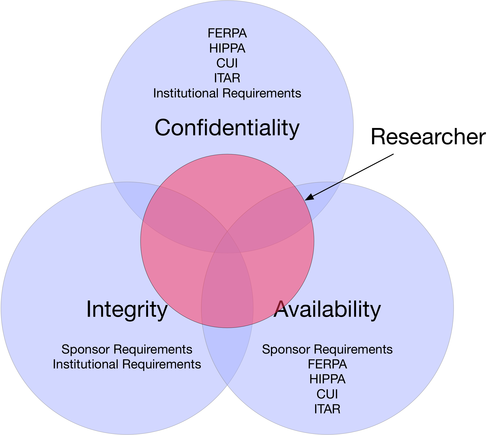

---
title: Are My Data Safe?
author:
  - Jonathan Wheeler^[UNM Research Data Services, jwheel01@unm.edu]
  - Karl Benedict^[UNM Research Data Services, kbene@unm.edu]
margin-left: 1in
margin-right: 1in
margin-top: .5in
margin-bottom: .5in
...

## Principles

**Confidentiality**

Information requires protection from unauthorized disclosure.

**Integrity**

Information must be protected from unauthorized, unanticipated, or unintentional modification.

**Availability**

The system or data must be available for use for intended purposes.

## A System View

| **Component** | **Strategies & Considerations** |
| ----------- | -------------- | ---------- |
| storage     | replicated, verified backups |
| access      | physical controls, strong passwords, two factor authentication |
| transmission| secure transmission |
| encryption  | file and volume level encryption |

### Reference

-Swanson, M., & National Institute of Standards and Technology (U.S.). (2001). *Security self-assessment guide for information technology systems* (NIST special publication ; Computer security, 800-26; NIST special publication, 800-26; NIST special publication, Computer security.3223114). Gaithersburg, MD: U.S. Dept. of Commerce, Technology Administration, National Institute of Standards and Technology. http://books.google.com/books?id=-AVRAAAAMAAJ

## Regulatory Compliance

* FERPA
  * [Protecting Student Privacy](https://studentprivacy.ed.gov/)
  * [Data De-identification: An Overview of Basic Terms](https://studentprivacy.ed.gov/sites/default/files/resource_document/file/data_deidentification_terms_0.pdf)
* HIPAA
  * [Summary of the HIPAA Security Rule](https://www.hhs.gov/hipaa/for-professionals/security/laws-regulations/index.html)
* [Controlled Unclassified Information (CUI)](https://www.archives.gov/cui)
  * [CUI Registry - Categories and Subcategories](https://www.archives.gov/cui/registry/category-list)
* [ITAR & Export Control](http://researchcompliance.unm.edu/exportcontrol/lawsandgoverningagencies)
* [NM State](http://164.64.110.239/nmac/parts/title01/01.021.0002.htm)
* Sponsor requirements
* Institutional requirements (reflecting both regulatory and institutional needs)
    * [Research Misconduct](http://handbook.unm.edu/policies/section-e/e40.html)
    * [Information Security](https://policy.unm.edu/university-policies/2000/2550.html)

## A Synthesis

{width=6.5in}\ 

---------------------

| Download this document: [https://unmrds.github.io/bb-security/bb-security.pdf](https://unmrds.github.io/bb-security/bb-security.pdf)
| Github Repository: [https://github.com/unmrds/bb-security](https://github.com/unmrds/bb-security)

---------------------

| 
| This work is licensed under a [Creative Commons Attribution 4.0 International License](http://creativecommons.org/licenses/by/4.0/)
